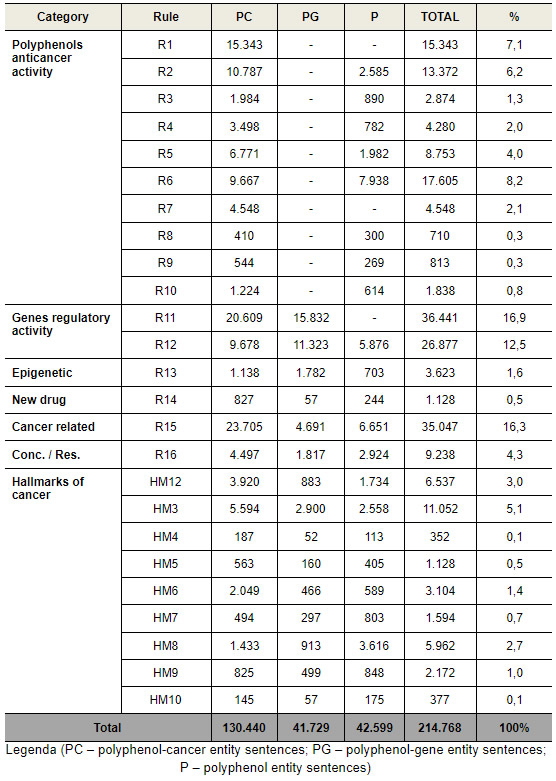

<h1>Information extraction from PubMed abstracts sentences on polyphenols anticancer activity</h1>

This repository contains files and information about <strong> step 2 of Kaphta Architecture: Information Extraction</strong>. In this stage, PubMed abstracts classified as positive in the previous stage (<a href='https://github.com/ramongsilva/Text-classification-of-pubmed-abstracts-on-polyphenols-anticancer-activity'>Text Classification step</a>) were used to extract information. Information was extracted from sentences of PubMed abstracts with associations of recognized entities. The following are the files used in the tasks of: NER (Named entity recognition), AR (Association recognition) and your respective results:

<h2>NER (Named entity recognition)</h2>
<ul>
  <li><a href='https://github.com/ramongsilva/Information-extraction-from-pubmed-abstracts-sentences-about-polyphenols-anticancer-activity/blob/main/ner-pubmed-abstracts-gh.R'>ner-pubmed-abstracts-gh.R</a>: R script for named entity recognition (NER) in PubMed abstracts classified as positive in the previous stage (<a href='https://github.com/ramongsilva/Text-classification-of-pubmed-abstracts-on-polyphenols-anticancer-activity'>Text Classification step</a>), using PubTator API</li>
  <li><a href='https://github.com/ramongsilva/Information-extraction-from-pubmed-abstracts-sentences-about-polyphenols-anticancer-activity/blob/main/functions.R'>functions.R</a>: R script with auxiliary functions. Save this file in the same folder of ner-pubmed-abstracts-gh.R and association-recognition-pubmed-abstracts-gh.R scripts, because it is needed to execute these scripts.</li>
<li><a href='https://drive.google.com/file/d/1lQRdff2YpagowcLcdVSF5z2AO5tdwOIS/view?usp=sharing' target='_blank'>db_total_project.db</a>:  SQLite Database needed to execute all R scripts of kaphta architecture steps. This database contains tables with the<strong> Entity dictionary, Total PubMed abstracts textual corpus, and Pubmed abstracts classified as positive in text classification</strong>. Save this file in the same folder of ner-pubmed-abstracts-gh.R script, because it is needed to execute this script.</li>
</ul>

<h2>AR (Association recognition)</h2>
<ul>
  <li><a href='https://github.com/ramongsilva/Information-extraction-from-pubmed-abstracts-sentences-about-polyphenols-anticancer-activity/blob/main/association-recognition-pubmed-abstracts-gh.R'>association-recognition-pubmed-abstracts-gh.R</a>: R script for association recognition (AR) in PubMed abstracts classified as positive in the previous stage (<a href='https://github.com/ramongsilva/Text-classification-of-pubmed-abstracts-on-polyphenols-anticancer-activity'>Text Classification step</a>), using regular expressions from rules dictionary (see <a href='https://github.com/ramongsilva/sequential-pattern-mining-in-pubmed-abstracts-sentences'>sequential-pattern-mining-in-pubmed-abstracts-sentences</a> repository). 
    <ul><li><small>To execute this R script it's necessary to download the <a href='https://github.com/ramongsilva/Information-extraction-from-pubmed-abstracts-sentences-on-polyphenols-anticancer-activity/tree/main/entities-associations-sentences-recognized'>entities-associations-sentences-recognized</a> and <a href="https://github.com/ramongsilva/Information-extraction-from-pubmed-abstracts-sentences-on-polyphenols-anticancer-activity/tree/main/entities-recognized">entities-recognized</a> folders.</small></li></ul></li>
 </ul>

<h2>Results of the NER and AR tasks</h2>
<ul>
    <li><a href='https://github.com/ramongsilva/Information-extraction-from-pubmed-abstracts-sentences-about-polyphenols-anticancer-activity/tree/main/entities-recognized'>entities-recognized</a>: folder with files resulted from NER task in information extraction with the <strong>named entities (polyphenols, cancers and genes) recognized on PubMed abstracts classified as positive in the previous stage </strong>(<a href='https://github.com/ramongsilva/Text-classification-of-pubmed-abstracts-on-polyphenols-anticancer-activity'>Text Classification step</a>). Save this folder with the files in the same folder of association-recognition-pubmed-abstracts-gh.R script, because it is needed to execute this script, on the Association recognition task.</li>
  <li><a href='https://github.com/ramongsilva/Information-extraction-from-pubmed-abstracts-sentences-about-polyphenols-anticancer-activity/tree/main/entities-associations-sentences-recognized'>entities-associations-sentences-recognized</a>: folder with files resulted of NER task in information extraction with <strong> sentences recognized with entities (polyphenols, cancers and genes) associations on PubMed abstracts classified as positive in the previous stage</strong> (<a href='https://github.com/ramongsilva/Text-classification-of-pubmed-abstracts-on-polyphenols-anticancer-activity'>Text Classification step</a>). Save this folder with the files in the same folder of association-recognition-pubmed-abstracts-gh.R script, because it is needed to execute this script, on the Association recognition task.</li>
    <li><a href='https://github.com/ramongsilva/Information-extraction-from-pubmed-abstracts-sentences-about-polyphenols-anticancer-activity/tree/main/ner-frequency'>ner-frequency</a>: folder with files with the frequency of entities about polyphenols, cancers and/or genes recognized in PubMed abstracts classified as positive in the previous stage (<a href='https://github.com/ramongsilva/Text-classification-of-pubmed-abstracts-on-polyphenols-anticancer-activity'>Text Classification step</a>).</li>
    <li><a href='https://github.com/ramongsilva/Information-extraction-from-pubmed-abstracts-sentences-about-polyphenols-anticancer-activity/blob/main/Rule_associations_recognized.rar'>Rule_associations_recognized.rar</a>: compacted file resulted of AR task containing the PubMed abstract sentences with at least one rule from rules dictionary recognized.</li>
</ul>

<h2>Result of AR task</h2>

Bellow is presented a table with the results of the Association Recognition task, separated for category, rules and sentence type (PC, PG, and P).

<h3>Table with the total of the recognized sentences associations for the different sentence type</h3>

